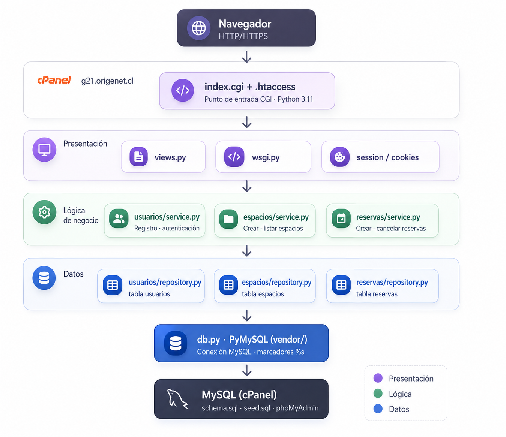

# Sistema de Reservas — Módulo 2

Aplicación web para reservar espacios y recursos. Monolito modular en **Python puro** (sin frameworks), con MySQL y desplegado en cPanel como aplicación WSGI ejecutada por **CGI** (sin Passenger).

## Documentación

| Documento | Ubicación |
|---|---|
| Documento técnico | [`docs/documento-técnico.pdf`](docs/documento-técnico.pdf) |
| Diagrama de arquitectura | [`docs/diagrama-arquitectura.png`](docs/diagrama-arquitectura.png) |

## Arquitectura



```
Presentación  →  Lógica de negocio  →  Datos
(views.py)       (service.py x3)       (repository.py x3 + db.py)
```

Tres módulos de dominio: `usuarios`, `espacios`, `reservas`.  
Regla de acoplamiento: un módulo solo llama al `service` de otro (nunca a su `repository` ni a sus tablas).

## Setup local

```bash
python -m venv .venv && source .venv/bin/activate
pip install -r requirements.txt -r requirements-dev.txt
cp .env.example .env          # completar con tus credenciales MySQL locales
```

Cargar el esquema y los datos de ejemplo en MySQL:

```bash
mysql -u <user> -p <db> < db/schema.sql
mysql -u <user> -p <db> < db/seed.sql
```

Correr el servidor de desarrollo:

```bash
python -m app.devserver        # http://localhost:8000
```

### Usuarios de prueba (seed)

| Email | Contraseña | Rol |
|---|---|---|
| admin@demo.cl | Admin1234 | admin |
| usuario@demo.cl | Usuario1234 | usuario |

## Pruebas

```bash
# Unitarias (sin MySQL)
pytest tests/unit -v
pytest --cov=app tests/unit

# Carga (requiere la app corriendo en localhost:8000)
locust -f tests/carga/locustfile.py --host http://localhost:8000
# Headless:
locust -f tests/carga/locustfile.py --host http://localhost:8000 \
       --headless -u 50 -r 5 -t 1m --csv resultados_carga
```

## Rutas disponibles

| Método | Ruta | Descripción |
|---|---|---|
| GET | `/` | Redirige a `/espacios` (con sesión) o `/login` (sin sesión) |
| GET/POST | `/registro` | Crear cuenta |
| GET/POST | `/login` | Iniciar sesión |
| POST | `/logout` | Cerrar sesión |
| GET | `/espacios` | Listar espacios |
| POST | `/espacios` | Crear espacio (solo admin) |
| GET | `/reservas` | Mis reservas (requiere sesión) |
| POST | `/reservas` | Crear reserva (requiere sesión) |
| POST | `/reservas/cancelar` | Cancelar reserva propia |

## Despliegue en cPanel por CGI (`g21.origenet.cl`)

El hosting del curso **no tiene "Setup Python App" (Passenger) ni acceso a terminal/SSH**: solo
File Manager y phpMyAdmin por GUI. Como el callable `application` de `app/wsgi.py` es WSGI
estándar, se ejecuta por **CGI** con `wsgiref.handlers.CGIHandler` (librería estándar) sin tocar
la lógica de negocio.

### Archivos de despliegue

| Archivo | Para qué |
|---|---|
| `index.cgi` | Punto de entrada CGI: carga el `.env` y ejecuta la app vía `CGIHandler`. |
| `.htaccess` | Activa CGI (`ExecCGI`), enruta todo a `index.cgi` preservando `PATH_INFO` y bloquea acceso directo a `.env`/`.py`/`.sql`. |
| `vendor/pymysql/` | Driver PyMySQL **vendorizado** (copiado), porque no hay `pip` en el hosting. `index.cgi` lo agrega a `sys.path`. |
| `info.cgi` | Script de **sondeo temporal** (versión de Python, PyMySQL, intérpretes disponibles). **Borrar del servidor al terminar.** |
| `passenger_wsgi.py` | Se conserva por si algún día habilitan Passenger; no se usa en CGI. |

### Pasos

1. **MySQL** — en **MySQL® Databases** crear base + usuario con ALL PRIVILEGES. Importar
   `db/schema.sql` y `db/seed.sql` por **phpMyAdmin → Import** (con la base seleccionada).
2. **Subir el código** al **document root** del dominio — en este hosting es **`public_html/`
   directamente** (es el dominio principal), *no* una subcarpeta. Subir el ZIP del repo
   (incluyendo `vendor/`, `index.cgi`, `.htaccess`) y **Extract**.
3. **Crear el `.env`** a mano con el editor del File Manager, en el mismo docroot, con las
   variables de `.env.example` y las credenciales reales (`DB_HOST=localhost`, `DB_PORT`,
   `DB_NAME`, `DB_USER`, `DB_PASSWORD`, `SECRET_KEY`). **No** se sube del repo (está en `.gitignore`).
4. **Permisos** — dar **chmod 755** a `index.cgi` (y a `info.cgi` mientras diagnosticas).
   Clic derecho → *Change Permissions*. ⚠️ El File Manager **resetea permisos a 644 en cada
   subida**: vuelve a aplicar 755 tras re-subir un `.cgi`.
5. **Intérprete** — abrir `https://g21.origenet.cl/info.cgi` y verificar la versión de Python.
   El `/usr/bin/python3` del sistema es **3.6** (insuficiente: los modelos usan `dataclasses` y
   `int | None`). Se usa el **alt-python 3.11** de CloudLinux mediante el shebang de `index.cgi`:
   `#!/opt/alt/python311/bin/python3`. Ajusta esa primera línea a la ruta que reporte tu `info.cgi`
   (Python ≥ 3.10). **Borra `info.cgi`** cuando termines.
6. Abrir `https://g21.origenet.cl/` → debe cargar la app.
7. **HTTPS** — en **SSL/TLS Status** ejecutar **Run AutoSSL**.

### Notas / gotchas (lo que cuesta depurar)

- **Document root**: si subes a `public_html/g21.origenet.cl/` en vez de `public_html/`, todo da **404**.
- **Archivos ocultos**: activa *Settings → Show Hidden Files (dotfiles)* en el File Manager para ver `.env` y `.htaccess`.
- **Python del sistema (3.6) no sirve**: hay que apuntar el shebang al alt-python 3.11+ (`/opt/alt/python311/...`).
- **Sin `pip`**: por eso PyMySQL va vendorizado en `vendor/pymysql/`.
- **`PATH_INFO`**: el router usa `environ.get("PATH_INFO") or "/"` para tolerar la raíz servida vía `DirectoryIndex` (sin `PATH_INFO`).
- **Rendimiento**: CGI arranca un proceso Python y abre conexión MySQL en *cada* request — aceptable para el curso, pero más lento que Passenger.

> El skill `despliegue-cpanel` documenta el flujo "ideal" con Passenger; el hosting real del curso
> obligó a usar CGI, que es lo descrito arriba.

## Seguridad

- Contraseñas con `pbkdf2_hmac` (SHA-256, 200 000 iteraciones) + salt único por usuario.
- Sesión: cookie firmada con `hmac` (SHA-256) usando `SECRET_KEY`.
- Toda consulta SQL usa placeholders `%s` (anti inyección).
- Secretos solo en variables de entorno; `.env` en `.gitignore`.
- En producción (CGI): borrar `info.cgi` del servidor y evitar exponer el traceback completo de `app/wsgi.py` ante un error 500.
